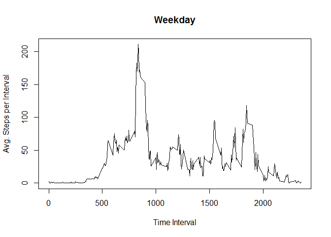

# Reproducible Research: Peer Assessment 1


## Loading and preprocessing the data

```r
activity = read.csv("./activity.csv", header = T)
```


## What is mean total number of steps taken per day?
Here is the histogram of total numbers of steps taken per day:

```r
sum_steps = tapply(X = activity$steps, INDEX = activity$date, FUN= sum)
hist(sum_steps, xlab = "Total Steps per day")
```

 

The mean and median can be calculated as following:

```r
mean_of_total = mean(sum_steps,na.rm = T)
median_of_total = median(sum_steps, na.rm = T)
```
Mean is 1.0766189\times 10^{4}
Median is 10765

## What is the average daily activity pattern?
We can graph the daily activity pattern:

```r
date = names(sum_steps)
mean_per_interval = tapply(X = activity$steps, INDEX = activity$interval, FUN = mean, na.rm = T)
plot(x = names(mean_per_interval), y = mean_per_interval, xlab = "Time Interval", ylab = "Avg. Steps per Interval",type = "l")
```

 

Now we find the time interval that contains the maximum number of steps:

```r
max_val = which.max(mean_per_interval)
max_interval = as.numeric(names(max_val))
```
The time interval is: 835


## Imputing missing values
First, let us compute the number of missing values:

```r
num_NA = length(activity$steps[is.na(activity$steps)])
```
The number of NAs is 2304

Then, create a new dataset which is identical with the dataset above while all the NAs are replaced by the mean of that interval:

```r
activity_v2 = read.csv("./activity.csv", header = T)
#Fill in NAs
##Use mean_per_interval
for(i in 1:length(activity_v2$steps)){
  if(is.na(activity_v2$steps[i])){
    which_interval =activity_v2$interval[i]
    activity_v2$steps[i] = mean_per_interval[which_interval/5+1]
  }
}
```

Now, we can graph a histogram of the new dataset:

```r
#make histogram of v2:
sum_steps_v2 = tapply(X = activity_v2$steps, INDEX = activity_v2$date, FUN= sum)
hist(sum_steps_v2, xlab = "Total Steps per day")
```

 

Moreover, it is possible to get the mean and median of the steps:

```r
#mean and mediant of v2
mean_of_total_v2 = mean(sum_steps_v2,na.rm = T)
median_of_total_v2 = median(sum_steps_v2, na.rm = T)
```
The new mean is 1.0766189\times 10^{4}
And the new median is 1.0765\times 10^{4}

## Are there differences in activity patterns between weekdays and weekends?
To begin with, we can create a factor indicating the weekdays andd weekends:

```r
#create factor with levels: weekday & weekend
activity_v2$date = as.Date(activity_v2$date)
tmp = weekdays(activity_v2$date)
wk = c(1:length(activity_v2$steps))

for(i in 1:length(activity_v2$steps)){
  if(tmp[i] == "Monday" || tmp[i] == "Tuesday" || tmp[i] == "Wednesday" || tmp[i] == "Thursday" || tmp[i] == "Friday"){
    wk[i] = "Weekday"
  }else{
    wk[i] = "Weekend"
  }
}
```

Finally, to see the difference in the patterns, we plot the data as following:

```r
activity_v2 = cbind(activity_v2,wk)
activity_weekday = split(activity_v2,activity_v2$wk)$Weekday
activity_weekend = split(activity_v2,activity_v2$wk)$Weekend
mean_weekday = tapply(X = activity_weekday$steps, activity_weekday$interval, mean, na.rm = T)
plot(x = names(mean_weekday), y = mean_weekday, xlab = "Time Interval", ylab = "Avg. Steps per Interval",type = "l",main = "Weekday")
```

 

```r
mean_weekend = tapply(X = activity_weekend$steps, activity_weekend$interval, mean, na.rm = T)
plot(x = names(mean_weekend), y = mean_weekend, xlab = "Time Interval", ylab = "Avg. Steps per Interval",type = "l",main = "Weekend")
```

 
